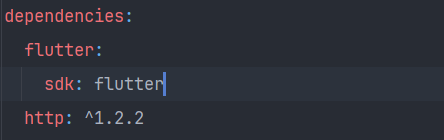
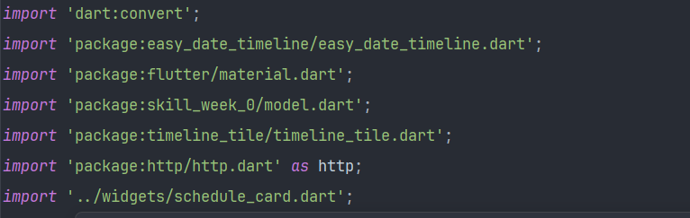
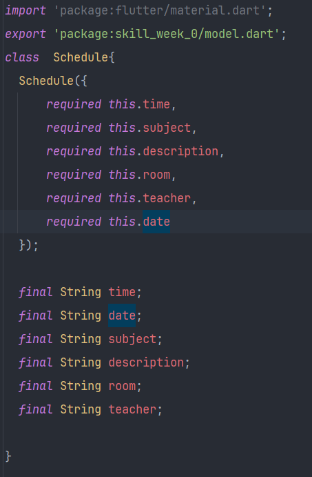
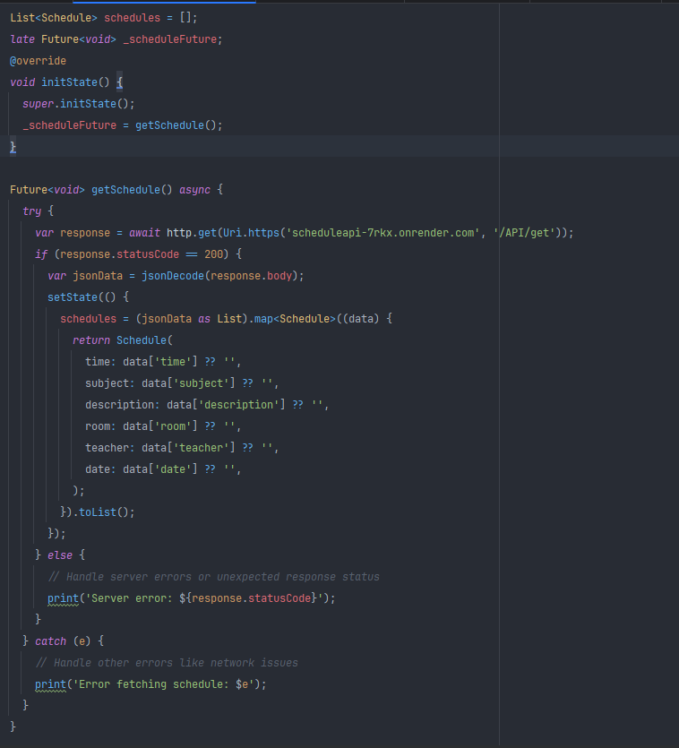
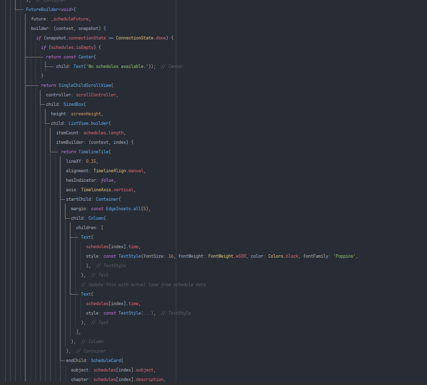
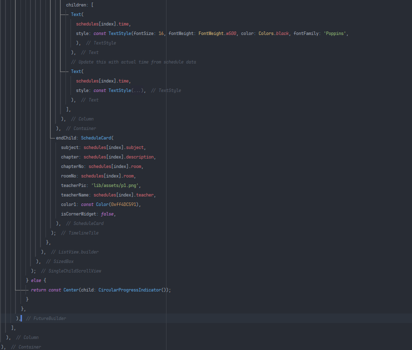

# skill_week_2
I here showcased my understanding on data fetching through API calling

## What is API ?
  API, or Application Programming Interface, is a set of rules or protocols
  that allows different software applications to communicate with each other.

## How API works ?
# The client application that needs to access data sends an API request. 
  e.g- a mobile app requests for weather data from a weather service API.
# The server hosting the API receives the request, processes it, and interacts
  with the database to get the requested information.
# The API server sends a response back to the client application with the 
  requested data in JSON or XML format.
# The client application processes the response and updates the data on  ui.

## Here is the following steps to be followed for getting data through API calling 
1. At first we have to add the http package to pubspec.yaml file which helps to make HTTP requests.
   
2. We have to import the "http/http.dart" package 
   
3. Create a Dart model class to represent the data structure returned by the API. For instance,
   if your API returns user data with fields like time, subject, description, room, teacher, date.
   We create a file named model.dart
   
4. In calender_page.dart file where we need to be show the data that we get from server, write a 
   Future to make an HTTP request to API. We can also add error handling messages . we added a list
   where we can store requested data in the format of data structure defined in model.dart file.
   
5. In the flutter widget we can fetch the API data. we used FutureBuilder to handle asynchronous data fetching & 
   
   